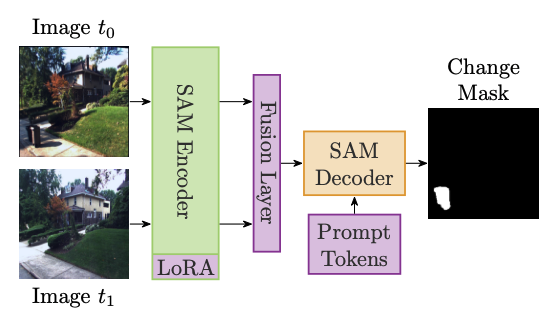

# ChangeSAM: Adapting the Segment Anything Model to Street Scene Image Change Detection

**International Conference on Intelligent Transportation Systems 2024 Paper**

ChangeSAM adapts the powerful [Segment Anything Model (SAM)](https://github.com/facebookresearch/segment-anything) for the specialized task of street scene image change detection. A light-weight fusion layer is used to fuse the bi-temporal information. Prompts are replaced with a learnt "change prompt". Low-Rank Adaptation (LoRA) is used to adapt the image encoder. The heavy SAM image encoder is replaced with MobileSAM to enable ChangeSAM for use on mobile platforms such as autonomous cars. The figures below show the two variants of ChangeSAM.

<figure style="display: inline-block; margin: 10px; text-align: center;">
  
  <figcaption>ChangeSAM Pre Decoder Fusion (PreDF)</figcaption>
</figure>
<figure style="display: inline-block; margin: 10px; text-align: center;">
  
  <figcaption>ChangeSAM Post Decoder Fusion (PostDF)</figcaption>
</figure>

Only purple modules are adapted during training.

The accompanying paper presents experiments on point sampling strategies and investigates the effect of varying the number of sampling points per roof instance.

---

## Table of Contents

- [Quick Start](#quick-start)
- [Installation](#installation)
- [Dataset](#dataset)
- [Model Initialization](#model-initialization)
- [Tools](#tools)
- [License](#license)
- [Citing ChangeSAM](#citing-changesam)
- [Acknowledgements](#acknowledgements)

---

## Quick Start
### Train ChangeSAM
```bash
# download VL-CMU-CD to ./VL-CMU-CD
gdown --id 1iQa9OAHNAhzO0tCufpgpowkHvkeUNxVG
unzip VL-CMU-CD.zip
# download mobile-sam checkpoint to ./mobile_sam.pt
wget https://github.com/ChaoningZhang/MobileSAM/raw/refs/heads/master/weights/mobile_sam.pt
pip install git+https://github.com/tritolol/ChangeSAM
changesam_train.py --dataset-root VL-CMU-CD --sam-checkpoint mobile_sam.pt
```

### Test ChangeSAM
```bash
# expects checkpoint ./best_adapted_checkpoint.pt (created by changesam_train.py)
changesam_test.py --dataset-root VL-CMU-CD --sam-checkpoint mobile_sam.pt
```

## Installation
ChangeSAM requires:
- **Python**: version `>=3.10.8`
- **PyTorch**: version `>=2.0.1`
- **TorchVision**: version `>=0.15.2`

*Note:* For optimal performance, install PyTorch and TorchVision with CUDA support. Follow the [official PyTorch installation instructions](https://pytorch.org/get-started/locally/) to set up your environment.

### Installing ChangeSAM
You can install ChangeSAM directly from GitHub:

```bash
pip install git+https://github.com/tritolol/ChangeSAM
```

Or, to install locally:
```bash
git clone git@github.com:tritolol/ChangeSAM.git
cd changesam
pip install -e .
```

## Dataset
ChangeSAM is trained and evaluated on the VL-CMU-CD dataset which can be downloaded from [here](https://drive.google.com/file/d/1iQa9OAHNAhzO0tCufpgpowkHvkeUNxVG/view?usp=share_link).

## Model Initialization
ChangeSAM can be initialized either from the MobileSAM checkpoint (recommended, [download here](https://github.com/ChaoningZhang/MobileSAM/raw/refs/heads/master/weights/mobile_sam.pt)) or the original SAM checkpoint from the [SAM repository](https://github.com/facebookresearch/segment-anything#model-checkpoints) (untested).
During training, ChangeSAM checkpoints containing weights for the tuned prompt tokens, the fusion layer and optionally the LoRA weights of certain layers in the image encoder are stored and can be used for testing.

## Tools
The repository provides several command-line tools located in the `tools/` directory. These scripts are installed to your PATH during setup and can be configured via command-line arguments (use `-h` for help).

- Training:

    `changesam_train.py`

    Description: Train the ChangeSAM model using the provided dataset.
- Testing:

    `changesam_test.py`

    Description: Evaluate a trained model.
- Embedding Precomputation:

    `changesam_precompute_embeddings.py`

    Description: Precompute image embeddings using the SAM image encoder across one or multiple supported pytorch devices. These embeddings are not required but can speed up training significantly if neither augmentation nor image encoder adaptation is desired.

Usage example to see all available options for a tool:
```bash
changesam_train.py -h
```

## License

The repository is licensed under the [Apache 2.0 license](LICENSE).

## Citing ChangeSAM

```bibtex
@misc{TBA,
  title={ChangeSAM: Adapting the Segment Anything Model to Street Scene Image Change Detection},
  note={To appear in International Conference on Intelligent Transportation Systems 2024}
}
```
*Note*: Citation details will be updated upon publication.

## Acknowledgements

<details>
    <summary>
        <a href="https://github.com/facebookresearch/segment-anything">SAM</a> (Segment Anything) [<b>bib</b>]
    </summary>

```bibtex
@article{kirillov2023segany,
title={Segment Anything}, 
author={Kirillov, Alexander and Mintun, Eric and Ravi, Nikhila and Mao, Hanzi and Rolland, Chloe and Gustafson, Laura and Xiao, Tete and Whitehead, Spencer and Berg, Alexander C. and Lo, Wan-Yen and Doll{\'a}r, Piotr and Girshick, Ross},
journal={arXiv:2304.02643},
year={2023}
}
```
</details>
<details>
    <summary>
        <a href="https://github.com/ChaoningZhang/MobileSAM">MobileSAM</a> [<b>bib</b>]
    </summary>

```bibtex
@article{mobile_sam,
title={Faster Segment Anything: Towards Lightweight SAM for Mobile Applications},
author={Zhang, Chaoning and Han, Dongshen and Qiao, Yu and Kim, Jung Uk and Bae, Sung-Ho and Lee, Seungkyu and Hong, Choong Seon},
journal={arXiv preprint arXiv:2306.14289},
year={2023}
}
```
</details>
<details>
    <summary>
        <a href="https://arxiv.org/abs/2106.09685">LoRA</a> [<b>bib</b>]
    </summary>

```bibtex
@misc{hu2021loralowrankadaptationlarge,
title={LoRA: Low-Rank Adaptation of Large Language Models}, 
author={Edward J. Hu and Yelong Shen and Phillip Wallis and Zeyuan Allen-Zhu and Yuanzhi Li and Shean Wang and Lu Wang and Weizhu Chen},
year={2021},
eprint={2106.09685},
archivePrefix={arXiv},
primaryClass={cs.CL},
url={https://arxiv.org/abs/2106.09685}, 
}
```
</details>